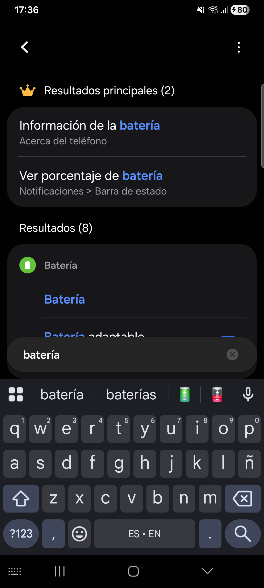
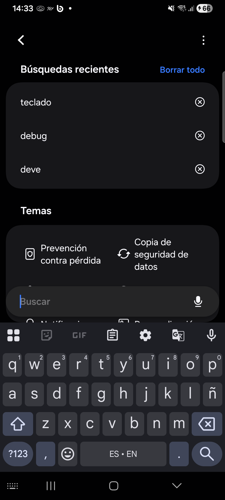

# Mobile Test Automation — Appium + Python on a Physical Samsung Device

A single, rigorously documented Appium test case that drives the native Android Settings app on a physical Samsung Galaxy A33, built to demonstrate robust locator strategy and real device-level debugging.

## Overview

This repository contains one end-to-end mobile test script written in Python with the Appium Python Client v3 and the UiAutomator2 driver. It launches the native Settings app, opens the search screen, types a query, and captures screenshot evidence.

The value of this project is not its size — it is honest and intentionally small — but the engineering behind it: every locator was verified against the real page source of a Samsung One UI device, every failure mode was reproduced and diagnosed on hardware, and every fix was validated by actual runs before being accepted.

## Portfolio Context

This project was developed by a Senior QA professional with a strong functional-testing background moving into advanced test automation, using an **AI-assisted engineering workflow** (see [AI-Assisted Engineering Workflow](#ai-assisted-engineering-workflow)). The QA engineer owned scope, verification, and acceptance on a physical device; the AI coding agent proposed changes that were syntax-checked and executed end-to-end before acceptance.

## Tech Stack

| Component | Version / Detail |
|-----------|------------------|
| Language | Python 3.x (development done on Python 3.12) |
| Test script | `test_mi_app.py` (standalone script, run directly) |
| Client library | `Appium-Python-Client` v3 |
| Appium Server | 3.8.0 |
| Driver | UiAutomator2 8.7.0 |
| Selenium | Used through the Appium client (`WebDriverWait`, `expected_conditions`) |
| Device communication | ADB (Android platform-tools) |
| Device under test | Samsung Galaxy A33 (SM-A336M), Android 16, One UI — physical device, selected via the `udid` capability loaded from the local (gitignored) `config.json` |
| App under test | Native Android Settings (`com.android.settings`) |

> Emulators are not part of the verified setup. All results reported here were produced on the physical Samsung device only.

## How It Works

The script runs a linear session against a locally running Appium server:

1. Build `UiAutomator2Options` (platform, device serial loaded from the local `config.json`, `noReset`, `forceAppLaunch`, package/activity) and open a session against `http://127.0.0.1:4723`.
2. Apply a **clean-start block**: force-stop the leftover search package (`com.android.settings.intelligence`), then activate Settings so every run begins on the Settings homepage.
3. Locate the search button through an ordered fallback chain of locators, tap it.
4. Locate the search field through a second ordered fallback chain, type `batería`.
5. Save the screenshot evidence (`evidence_test.png`), close the session, and exit with code 0.
6. On any failure: capture `evidence_error.png`, print the error, re-raise (never swallowed), and still close the session in `finally`.

Explicit waits (`WebDriverWait` + `element_to_be_clickable`) drive element handling, backed by a 10-second implicit wait; each fallback attempt has its own short timeout and `try/except`.

## Prerequisites

Install and verify each component before running the test.

### 1. Python

Install Python 3.x (development used 3.12):

```bash
python --version
```

Install the Appium client library:

```bash
pip install Appium-Python-Client
```

### 2. Appium Server and UiAutomator2 driver

Appium 3.x is distributed via npm:

```bash
npm install -g appium
appium driver install uiautomator2
```

Verify the installation:

```bash
appium driver list --installed
```

Start the server (keep this terminal open):

```bash
appium
```

The server must be listening on `http://127.0.0.1:4723` (Appium 2/3 — no `/wd/hub` suffix).

### 3. Android ADB setup

1. Install Android SDK **platform-tools** so `adb` is available on your PATH.
2. On the device, enable **Developer options** → **USB debugging**.
3. Connect the device by USB and authorize the debugging prompt if it appears.
4. Verify the device is visible and authorized:

```bash
adb devices
```

The output must list exactly one device with state `device`. Any other state (`unauthorized`, `offline`, empty list) must be resolved before running the test.

### 4. Device targeting (local config, never committed)

The physical device serial is **not** hardcoded in the script. It lives in a local `config.json` next to the script, which is listed in the repository's `.gitignore`, so it can never be pushed to GitHub:

1. Copy the template to a local file:

   ```bash
   copy config.example.json config.json
   ```

2. Open `config.json` and set your own serial from `adb devices`:

   ```json
   { "udid": "R58M1234567" }
   ```

3. If `config.json` is missing, the script fails fast with a clear message telling you exactly what to create. If `udid` is `null`, Appium picks the only connected device.

Anyone cloning the repository repeats these three steps with their own device — your serial never needs to touch GitHub.

## Project Structure

```text
01 System apps practice/
├── test_mi_app.py        # Test script: session setup, clean start, locator fallback
│                         # chains, search flow, screenshot evidence, teardown
├── config.example.json   # Device-config template (copy to config.json)
├── evidence_test.png     # Evidence: screen captured on test success
├── evidence_error.png    # Evidence: screen captured at the moment of a failure
├── AGENTS.md             # Project context: environment, device, selector rules
└── README.md             # This document
```

## Test Case: TC-AND-001 — Open Settings and Search

Formal QA artifact describing the single implemented test case.

| Field | Value |
|-------|-------|
| **Test ID** | TC-AND-001 |
| **Title** | Open Settings and perform a search query |
| **Objective** | Verify that the Settings homepage is reachable in a repeatable way and that its search screen can be opened and fed a query on a physical Samsung One UI device. |
| **Type** | End-to-end functional, UI automation |
| **App under test** | `com.android.settings` (activity `.Settings`) |
| **Environment** | Samsung Galaxy A33 (SM-A336M), Android 16, One UI, physical device via ADB; Appium Server 3.8.0 + UiAutomator2 8.7.0 |
| **Script** | `test_mi_app.py` → `test_open_settings_and_search()` |
| **Evidence artifact** | `evidence_test.png` (success), `evidence_error.png` (failure) |

### Preconditions

- [ ] Appium Server is running and listening on `http://127.0.0.1:4723`.
- [ ] The `uiautomator2` driver is installed.
- [ ] The physical device is connected, authorized, and `adb devices` reports state `device`.
- [ ] The device screen is on and unlocked.
- [ ] A local `config.json` exists (copied from `config.example.json`) with the `udid` of the connected device.
- [ ] `Appium-Python-Client` is installed in the active Python environment.

### Steps

| # | Given | When | Then |
|---|-------|------|------|
| 1 | The Appium server is running and the device is connected | The script is executed with `python test_mi_app.py` | A session is created and the session ID is printed; the window size is reported as `{'width': 1080, 'height': 2400}` |
| 2 | The search screen may still be open from a previous run | The clean-start block runs (`terminate_app` on `com.android.settings.intelligence`, then `activate_app` on `com.android.settings`) | The Settings homepage is in the foreground, regardless of leftover state |
| 3 | The Settings homepage is visible | The script locates and taps the search button | The search screen opens and the search field is displayed |
| 4 | The search screen is open | The script types `batería` into the search field | The query appears in the search field and search results start rendering |
| 5 | The query has been entered | The script saves the screenshot | `evidence_test.png` is written next to the script and the console reports `Screenshot saved (True)` |
| 6 | The evidence has been captured | The script finishes | The success message is printed, the Appium session is closed, and the process exits with code 0 |

### Acceptance Criteria

- [ ] **AC-1:** The Appium session starts without error and a session ID is printed.
- [ ] **AC-2:** Settings opens on its homepage even when a previous run left the search screen open (clean start works).
- [ ] **AC-3:** The search button is located and clicked without a `TimeoutException`.
- [ ] **AC-4:** The query `batería` is entered into the search field (the field is resolved as `android.widget.AutoCompleteTextView`).
- [ ] **AC-5:** `evidence_test.png` is created and the console reports the screenshot was saved (`True`).
- [ ] **AC-6:** The script prints `Test completed successfully.`, closes the session, and exits with code 0.
- [ ] **AC-7 (failure path):** On any failure, `evidence_error.png` is captured (if the session exists), the error is re-raised so the exit code is non-zero, and the session is still closed.

### Actual Result / Status

| Field | Value |
|-------|-------|
| **Status** | **PASSED** |
| **Verification** | Verified **twice consecutively** on the physical Samsung Galaxy A33, exit code 0 both times — including one run started from a "dirty" state where the previous run had left the search screen open. |
| **Evidence** | `evidence_test.png` |

## Locator Strategy and One UI Findings

This is the core engineering content of the project. All findings below were verified against the live page source of the Samsung SM-A336M (One UI), not assumed from stock Android documentation.

### Rule: never trust vanilla Android resource IDs on Samsung

Samsung's One UI layer renames, moves, or removes resource IDs that stock Android exposes. The mandatory project rule is: never hardcode a vanilla Android resource ID as the only locator — always keep verified-first, generic-second, idiom-independent-last fallback chains.

### Finding 1 — `forceAppLaunch` is required with `noReset` for system apps

With `noReset=true`, Appium skipped launching Settings entirely because the system-app process was already alive, so the test failed **before interacting with any element** — the problem was not a locator, the app was simply never opened. The root cause was traced in the driver source:

```text
if (noReset && !forceAppLaunch && processExists(appPackage))  ->  app is not launched
```

Fix: set the `appium:forceAppLaunch=true` capability so the launch is forced even when the process already exists.

### Finding 2 — The search button has no resource ID

Verified via page source: the search control is a `Button` with `content-desc="Buscar en Configuración"` and **no own resource-id**. Accessibility-id matching in Appium is **exact**, so generic values like `Search` or `Buscar` never matched — the original failure was a `TimeoutException` on this element.

### Finding 3 — The search field is not an `EditText`

The search screen runs in a **different package**: `com.android.settings.intelligence/.search.SearchActivity`. The field is an `android.widget.AutoCompleteTextView` (not `EditText`) with resource-id `com.android.settings.intelligence:id/search_src_text` and no `content-desc`. Any locator chain written for a vanilla `EditText` fails here.

### Finding 4 — Cross-run state leakage

Because the search screen lives in another package, a leftover `SearchActivity` from a previous run *resisted* the `am start` of Settings: focus stayed on the search screen, the Settings homepage never became visible, and the test failed at the first locator. Solved with a clean-start block at the top of the test:

```python
driver.terminate_app("com.android.settings.intelligence")  # force-stop leftover search screen
driver.activate_app(APP_PACKAGE)                            # bring Settings homepage to front
```

If the search screen was not open, `terminate_app` is a harmless no-op.

### Finding 5 — Ordered fallback chains, errors never swallowed

Both interaction blocks walk an ordered chain: the **verified locator first**, then generic and idiom-independent alternatives, then vanilla Android last. Each attempt has its own timeout and its own `try/except`, and the script prints which locator succeeded. If every locator fails, a clear message listing all attempted locators is printed and the error **propagates** — it is never silently swallowed.

**Search button chain:**

| Order | Locator | Rationale |
|------:|---------|-----------|
| 1 | `ACCESSIBILITY_ID` → `Buscar en Configuración` | Verified on this device via page source |
| 2 | `ACCESSIBILITY_ID` → `Search in Settings` | One UI English variant (reasonable, not verified) |
| 3 | `ACCESSIBILITY_ID` → `Buscar` | Generic Android, Spanish |
| 4 | `ACCESSIBILITY_ID` → `Search` | Generic Android, English |
| 5 | `XPATH` → `//android.widget.Button[contains(@content-desc, "uscar")]` | Last resort: text-fragment match, independent of exact wording and translation |

**Search field chain:**

| Order | Locator | Rationale |
|------:|---------|-----------|
| 1 | `CLASS_NAME` → `android.widget.AutoCompleteTextView` | Verified widget class on this device; language- and package-independent |
| 2 | `XPATH` → `//android.widget.EditText \| //android.widget.AutoCompleteTextView` | Union covers vanilla Android and One UI in one attempt |
| 3 | `ID` → `com.android.settings.intelligence:id/search_src_text` | Verified, but bound to this One UI package/version |
| 4 | `ACCESSIBILITY_ID` → `Buscar` | Generic Android, Spanish |
| 5 | `ACCESSIBILITY_ID` → `Search` | Generic Android, English |
| 6 | `CLASS_NAME` → `android.widget.EditText` | Vanilla Android class, last resort |

## How to Run

### Step 1 — Start the Appium server

```bash
appium
```

Leave this terminal running. You should see it listening on port `4723`.

### Step 2 — Verify the device

```bash
adb devices
```

Expected: one line with state `device`.

### Step 3 — Run the test

From the project directory, in a second terminal:

```bash
python test_mi_app.py
```

There is no test runner to install: the script is executed directly (it calls `test_open_settings_and_search()` under `if __name__ == "__main__":`).

## Expected Output

Representative output from a successful run on the physical device (session IDs and paths vary between runs; console messages follow the script's original wording):

```text
Session started. Session ID: <id>
Screen size: {'width': 1080, 'height': 2400}
Button located with: ACCESSIBILITY_ID 'Buscar en Configuración'
Field located with: CLASS_NAME 'android.widget.AutoCompleteTextView'
Screenshot saved (True): .../evidence_test.png
Test completed successfully.
Appium session closed.
```

On success the process exits with code `0`. On failure the error is printed (`Test failed: <ExceptionType>: <message>`), `evidence_error.png` is written, the exception is re-raised, and the exit code is non-zero.

## Evidence

| Artifact | When it is written |
|----------|--------------------|
| [`evidence_test.png`](evidence_test.png) | Screenshot captured after the query is entered — success evidence for TC-AND-001 |
| [`evidence_error.png`](evidence_error.png) | Screenshot captured at the moment of a failure (only if the session was established) |





## AI-Assisted Engineering Workflow

This project was built using an AI-assisted engineering workflow with **OpenCode**, an AI coding agent, while the QA engineer retained ownership of scope, verification, and acceptance.

The workflow was deliberately strict:

1. **AI proposed changes** — the agent drafted capabilities, locator chains, and clean-start logic based on observed failures.
2. **Syntax check** — every proposed change was compiled with `python -m py_compile` before being run.
3. **Real-device validation** — every change was executed end-to-end on the physical Samsung device; no change was accepted based on code review alone.
4. **QA acceptance** — the engineer verified the behavior against the acceptance criteria (including the dirty-state rerun) and only then accepted the change.

No result in this repository is reported without a real run on the physical device behind it.

## Troubleshooting

| Symptom | Check |
|---------|-------|
| Connection refused / session never starts | The Appium server must be running: start it with `appium` and confirm it listens on `http://127.0.0.1:4723`. |
| Device not found / `udid` errors | Run `adb devices` and confirm the device appears with state `device` (not `unauthorized` or `offline`), and that `config.json` (copied from `config.example.json`) holds the matching serial. |
| Test fails on the first locator | The device screen must be **on and unlocked** — a locked or off screen prevents the UI from being rendered and located. |
| App "opens" but the test fails immediately on a system app | Confirm `appium:forceAppLaunch=true` is set together with `noReset=true` (see Finding 1). |
| Locators time out after a device or OS update | Re-verify the page source: One UI may have changed the widget class, `content-desc`, or resource-id. Update the **first** element of the fallback chain. |

## Next Steps

Not implemented yet — listed as the natural continuation of this project:

- Migrate the script to **pytest** with fixtures for session/teardown and parametrized device configuration.
- Structured **test reporting** (Allure or JUnit XML) instead of console output.
- **CI integration** running against a device farm or a dedicated test device.
- Page Object Model once the suite grows beyond a single test case.
- Expanding coverage beyond the search flow of the Settings app.
